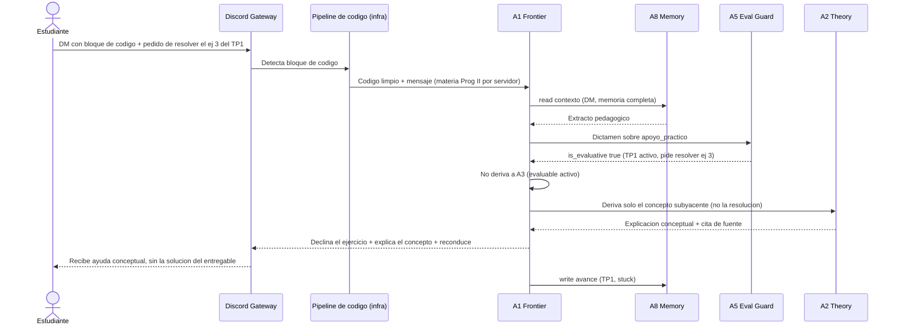
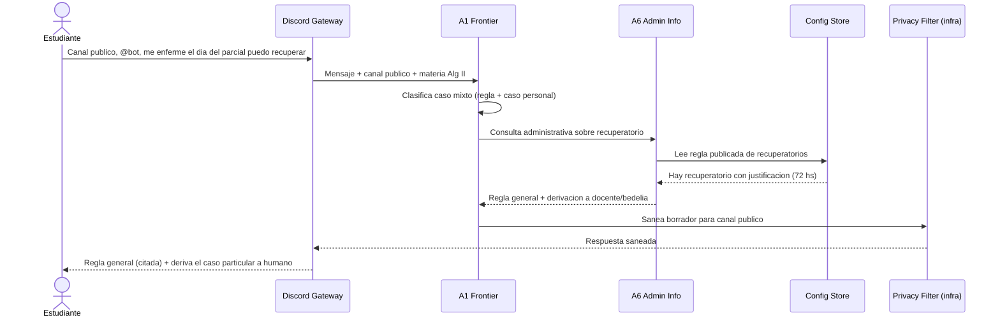
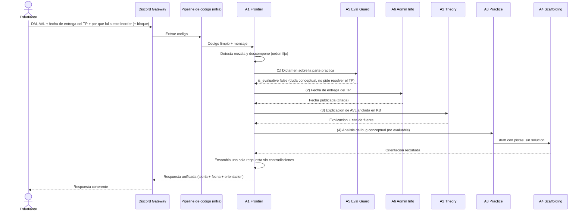
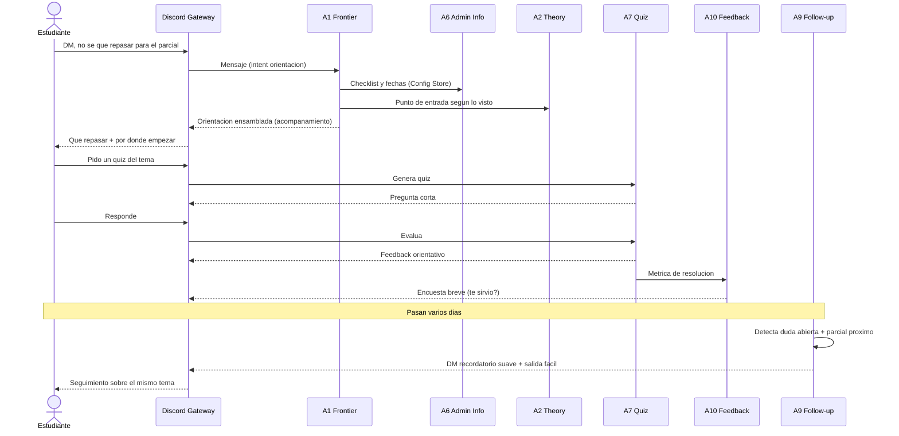

# Entregable 6 — Escenarios y trazabilidad

> [E0](00-glosario.md) · [E1](01-inventario-y-justificacion-de-agentes.md) · [E2](02-interaccion-y-coordinacion.md) · [E3](03-multi-materia.md) · [E4](04-memoria-entre-sesiones-y-seguimiento.md) · [E5](05-conexion-con-discord.md)

## 1. Propósito y alcance

Tres escenarios obligatorios por **tensión**: **A** pedagogía↔evaluable; **B** regla pública↔caso particular; **C** multi-dominio↔respuesta única. Cada uno: pasos + **diagrama de secuencia**. *Prog II* / *Álgebra II* ilustrativas (E3).

## 2. Escenario A — Programación y restricción pedagógica

**Tensión:** solución entregable de evaluable activo en un turno → ayuda sin entregar solución. **Contexto:** *Prog II*, DM, TP1 activo (ej. 3).

1. DM: código + pedido resolver ej. 3 TP1.
2. Infra: extrae código.
3. **A1:** `apoyo_practico`; A8 contexto; → **A5**.
4. **A5:** `is_evaluative=true` (TP1, ej. 3); sin redactar.
5. **A1:** no A3; declina; concepto → **A2**.
6. **A2:** concepto KB + cita; sin procedimiento entregable.
7. **A1:** ensambla declina + concepto + reconduce docentes.
8. **A8** `stuck`; opc. **A10** encuesta. Anti sobre-entrega: **A5**+postura **A1**/**A2**; **A4** en no evaluable (C).

## 3. Escenario B — Administrativo y límite institucional

**Tensión:** regla + caso particular → regla general, derivar humano. **Contexto:** *Álgebra II*, público @bot.

1. Pregunta recuperatorio por enfermedad.
2. Infra: verificado, Alg II, público → A1.
3. **A1:** caso mixto → **A6**.
4. **A6:** regla Config (ej. 72 h justificación) + derivación docente/bedelía.
5. **Privacy Filter:** sanea (sin sensibles).
6. Publica regla citada + frontera (no valida certificados).

## 4. Escenario C — Consulta mixta o ambigua

**Tensión:** teoría+admin+práctica → orden fijo, una respuesta. **Contexto:** *Prog II*, DM, TP árboles activo; código = duda conceptual.

1. Mensaje AVL + fecha TP + bug inorder + código.
2. Infra → A1: mezcla, orden fijo (E2 §8).
3. **A5:** `is_evaluative=false`.
4. **A6:** fecha citada.
5. **A2:** AVL + cita.
6. **A3→A4:** bug por categorías; densidad acotada.
7. **A1** ensambla AVL→fecha→código (sin resolver TP); **A8** registra. Un integrador; A5 antes de redactar código.

## 5. Escenario D (opcional) — Acompañamiento, autoevaluación, feedback y seguimiento

Bloques 3/5/6/7 no cubiertos por A/B/C. *Prog II*, DM.

1. Orientación: A1 → A6 fechas + A2 entrada (A8); ensambla.
2. Quiz: A7 → A8, métrica A10.
3. A10 encuesta (cooldown).
4. +N días: A9 scheduler, duda abierta + parcial, DM opt-out. Ver [E4](04-memoria-entre-sesiones-y-seguimiento.md).

## 6. Cobertura de los siete bloques funcionales

| Bloque | Dónde |
|---|---|
| 1. Teoría | C (AVL) |
| 2. Práctica/código | A, C |
| 3. Quiz | **D**, [E4](04-memoria-entre-sesiones-y-seguimiento.md) |
| 4. Admin | B, C, D |
| 5. Acompañamiento | **D**, [E4](04-memoria-entre-sesiones-y-seguimiento.md) |
| 6. Feedback | **D**, cierre A |
| 7. Memoria/seguimiento | **D**, A/C, [E4](04-memoria-entre-sesiones-y-seguimiento.md) |

## 7. Síntesis

**A:** A5 gate + A1/A2 concepto. **B:** A6 regla citada, deriva particular. **C:** orden fijo, A3→A4, ensamblaje A1. Diagramas = orden temporal y derivaciones.
