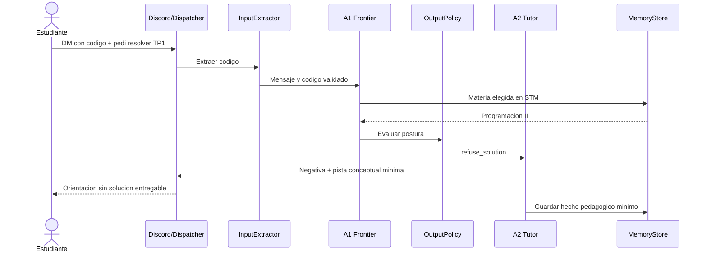
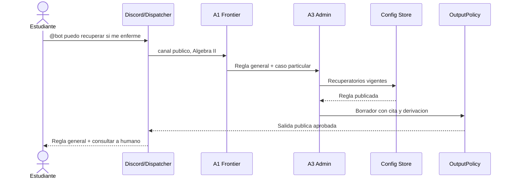
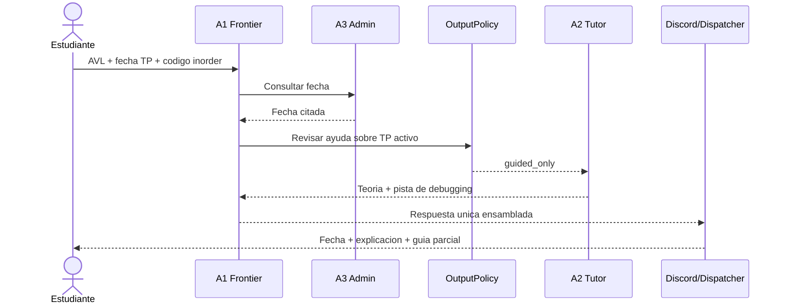
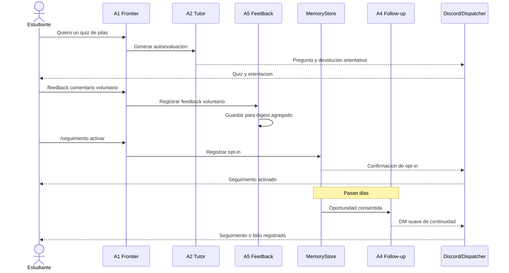

# Entregable 6 — Escenarios y trazabilidad

## 1. Escenario A — Código de evaluativa activa

**Contexto:** DM de Programación II; el estudiante ya seleccionó esa materia en la sesión. TP1 está activo.

1. El estudiante envía un bloque de código y pide: “pasame resuelto el ejercicio 3 del TP1”.
2. `InputExtractor` valida el bloque; `MemoryStore` aporta solo la materia elegida en STM.
3. A1 reconoce apoyo práctico y solicita la postura de salida.
4. `OutputPolicy` lee Config Store, identifica el TP activo y deriva a A2 con `refuse_solution`.
5. A2 rechaza producir una solución lista para entregar, pero señala una categoría de error o una pista mínima.
6. Dispatcher responde por DM y `MemoryStore` registra `tema=TP1`, `estado=stuck`, sin código crudo.

## 2. Escenario B — Regla general y caso particular

**Contexto:** canal público de Álgebra II; el estudiante menciona al bot: “me enfermé el día del parcial, ¿puedo recuperarlo?”.

1. SubjectRouter fija Álgebra II por el servidor.
2. A1 detecta información administrativa con caso personal.
3. A3 lee la regla vigente de recuperatorios en Config Store.
4. A3 redacta únicamente la regla general citada y deriva la evaluación del certificado o habilitación a docente/bedelía.
5. `OutputPolicy` confirma que la salida pública no contenga dato privado; Dispatcher publica.

## 3. Escenario C — Consulta mixta con ayuda parcial

**Contexto:** DM de Programación II. El TP de árboles está activo. El estudiante pregunta qué es AVL, cuándo entrega y por qué su recorrido `inorder` falla, adjuntando código.

1. A1 separa intención pedagógica y administrativa.
2. A3 obtiene la fecha publicada desde Config Store.
3. `OutputPolicy` marca la revisión del código como `guided_only`, porque es consulta parcial sobre un TP activo.
4. A2 explica AVL con cita de KB, propone diagnóstico conceptual del código y no reescribe la solución.
5. A1 ensambla explicación, fecha y orientación en una sola respuesta; Dispatcher la envía por DM.

## 4. Escenario D — Feedback y seguimiento

1. En DM, el estudiante pide un quiz de pilas; A2 lo genera y ofrece devolución orientativa.
2. El estudiante usa `/feedback`; A1 lo enruta a A5, que registra voluntariamente su comentario para un digest agregado.
3. El estudiante ejecuta `/seguimiento activar`; A1 lo enruta a MemoryStore, que guarda consentimiento.
4. Días después, Scheduler invoca A4 por una duda abierta; A4 redacta un DM suave.
5. Dispatcher envía el DM o registra fallo, sin publicar nada en el servidor.

## 5. Cobertura

| Funcionalidad | Escenario |
|---|---|
| Teoría | C |
| Práctica y código | A, C |
| Autoevaluación | D |
| Administrativo | B, C |
| Acompañamiento | C, D |
| Feedback docente | D |
| Memoria y proactividad | D |

Los escenarios trazan las decisiones críticas: ayuda graduada sin vigilancia, derivación humana, ingreso de código concreto, feedback voluntario, materia resuelta correctamente en DM y seguimiento consentido.
