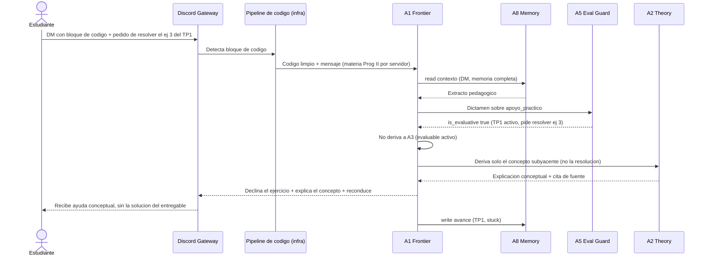
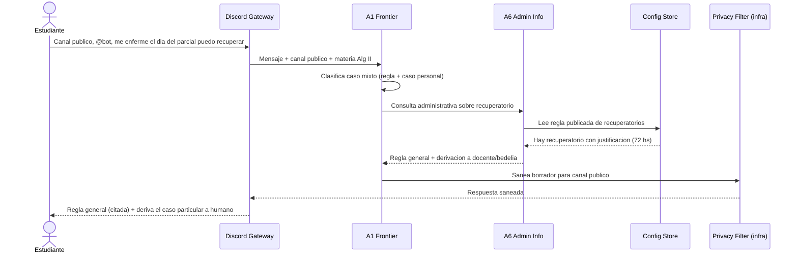
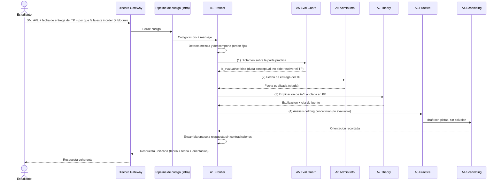
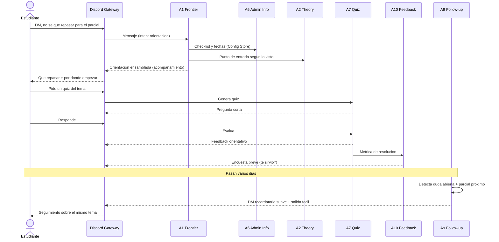

# Entregable 6 — Escenarios y trazabilidad

> Vocabulario en el [glosario (Entregable 0)](00-glosario.md); agentes en el [Entregable 1](01-inventario-y-justificacion-de-agentes.md); coordinación en el [Entregable 2](02-interaccion-y-coordinacion.md); multi-materia en el [Entregable 3](03-multi-materia.md); memoria en el [Entregable 4](04-memoria-entre-sesiones-y-seguimiento.md); Discord en el [Entregable 5](05-conexion-con-discord.md).

## 1. Propósito y alcance

Tres escenarios obligatorios, cada uno centrado en un **área de tensión distinta**:

- **A — Programación y restricción pedagógica** (tensión pedagógica ↔ código evaluable).
- **B — Administrativo y límite institucional** (tensión regla pública ↔ caso particular).
- **C — Consulta mixta** (tensión multi-dominio ↔ coherencia de una sola respuesta).

Cada escenario va **paso a paso** (qué agente actúa, qué hace, qué información circula) y acompañado de un **diagrama de secuencia** con orden temporal explícito, coherente con el relato. Las materias *Programación II* y *Álgebra II* son ilustrativas (cada una en su servidor, Entregable 3).

---

## 2. Escenario A — Programación y restricción pedagógica

**Tensión:** el estudiante pide, en un turno, la **solución entregable** de un evaluable activo. El sistema debe **ayudar sin entregar la solución** en ese intercambio.

**Contexto:** *Programación II*, **DM** (el alumno trabaja su entrega en privado). Hay un **TP1 entregable activo** declarado por el docente; el ejercicio 3 forma parte de él.

**Paso a paso:**

1. **Estudiante (DM):** envía un **bloque de código** y escribe *"che, pasame resuelto el ejercicio 3 del TP1 que entrego mañana"*.
2. **Discord Gateway + pipeline de código (infra):** detecta el bloque, lo **extrae y valida**; entrega el código limpio. (Es DM, no hace falta sugerir mover a privado.)
3. **A1 Frontier:** usuario verificado; materia = *Programación II* (resuelta por el **servidor**). Clasifica `intent = apoyo_practico`. Pide a **A8** el contexto (en DM, memoria completa de la materia). Como toda consulta práctica, deriva **primero a A5**.
4. **A5 Evaluative Guard:** lee las **evaluativas activas** del Config Store. El TP1 está activo y la consulta pide **resolver el ejercicio 3**. Devuelve `is_evaluative = true` (confianza alta), con justificación. **No** redacta respuesta.
5. **A1 (decisión de borde):** con `is_evaluative = true`, A1 **no deriva a A3** (por diseño, A3 no atiende consultas sobre un evaluable activo). Mantiene la **postura** pero **da ayuda igual**: declina resolver el ejercicio y **deriva el concepto teórico subyacente a A2** (despacho compuesto), aclarando que es el **concepto**, no la resolución del ejercicio.
6. **A2 Theory:** explica ese concepto anclado en la KB y **con cita de fuente**, manteniéndose en el nivel conceptual (sin el procedimiento puntual que el alumno debe resolver); su guardrail le impide "dar la respuesta completa".
7. **A1 ensambla y publica (DM):** declina el ejercicio + entrega la **explicación conceptual** de A2 + orienta a docentes para dudas de consigna. El alumno **recibe ayuda real** (el concepto) sin la solución del entregable.
8. **Registro y cierre:** A8 registra el tema y el estado (`stuck`); si el patrón se repitiera, A5 puede marcar `pattern_flag` para que el docente decida —sin bloquear al alumno. Opcional: **A10** lanza una **encuesta** breve por DM, respetando el cooldown.

**Quién evita la sobre-entrega (trazado explícito):** **A5** (gate: detecta el evaluable activo ⇒ A1 no va a A3) + la **postura de A1**, que limita la ayuda al **concepto** vía **A2** (cuyo guardrail evita "dar la respuesta completa"). El control de **densidad** de **A4** es el mecanismo complementario para la ayuda **no evaluable** (Escenario C). No se bloquean cadenas incrementales de preguntas (límite honesto declarado).

---

## 3. Escenario B — Administrativo y límite institucional

**Tensión:** una consulta mezcla **regla pública** con un **caso particular** del alumno (salud, recuperatorio). El sistema da la regla general pero **no** decide el caso ni tramita: **deriva** a la instancia humana.

**Contexto:** *Álgebra II*, **canal público** (el alumno @menciona al bot).

**Paso a paso:**

1. **Estudiante (público, @bot):** *"me enfermé el día del parcial, ¿puedo recuperarlo?"*.
2. **Discord Gateway + Auth Check (infra):** usuario verificado; materia = *Álgebra II* (por servidor). Entrega a A1 con `canal = publico`.
3. **A1 Frontier:** clasifica como **caso mixto** (regla administrativa + caso personal). Necesita la regla publicada, así que deriva a **A6**.
4. **A6 Admin Info:** lee del **Config Store** la regla de **recuperatorios** (p. ej. "hay recuperatorio con justificación oficial dentro de 72 hs"). Devuelve la **regla general literal** + una **derivación** explícita: el caso particular (si califica, certificado, ventana) lo resuelve el **docente/bedelía**.
5. **Privacy Filter (infra):** como el canal es público, sanea el borrador antes de publicar (acá la respuesta es regla general, sin datos sensibles).
6. **Publicación (público):** el bot responde con **(a)** la regla general citando que es **lo publicado por la cátedra**, y **(b)** la **frontera**: no valida certificados ni decide habilitaciones; orienta a docente/bedelía.

**Frontera trazada (qué dice vs qué deriva):** el sistema **dice** las reglas generales publicadas (recuperatorio, plazos) **citando la fuente**; **no** afirma si *ese* alumno califica, **no** tramita la licencia, **no** valida certificados → **deriva** a docente/bedelía. Coherente con los límites globales (no dar info institucional sensible, no reemplazar a la universidad).

---

## 4. Escenario C — Consulta mixta o ambigua

**Tensión:** un mismo mensaje mezcla **tres frentes** (teoría + administrativo + práctica con código). El sistema debe **descomponer**, tratar en un **orden fijo** y devolver **una sola respuesta sin contradicciones**.

**Contexto:** *Programación II*, **DM**. El **TP de árboles** está activo (evaluable). El alumno manda un bloque de código.

**Paso a paso (descomposición de orden fijo, Entregable 2 §8):**

1. **Estudiante (DM):** *"no entiendo bien los árboles AVL, además ¿cuándo se entrega el TP de árboles? y de paso, este recorrido *inorder* no me da bien, ¿por qué?"* + **bloque de código**. (La parte de código es una **duda conceptual**, no un pedido de resolver el entregable.)
2. **Gateway + pipeline de código:** extrae y valida el código.
3. **A1 Frontier:** detecta **mezcla** (teoría + admin + práctica). Aplica el **orden fijo**: primero filtros de política, después dominios, y **ensambla** al final.
4. **(1) A5 Evaluative Guard** (filtro de política sobre la parte práctica): el **TP de árboles** está activo, pero el código es una **duda conceptual** (no pide resolver el entregable) → `is_evaluative = false`. Habilita el frente de práctica.
5. **(2) A6 Admin Info:** devuelve la **fecha de entrega** publicada del TP de árboles (citando la fuente).
6. **(3) A2 Theory:** explica **AVL** anclado en la KB (con cita de fuente), al nivel del alumno.
7. **(4) A3 Practice → A4 Scaffolding:** A3 analiza el bug por **categorías de error** (sin reescribir la solución) y **A4** controla la **densidad** del borrador antes de publicar.
8. **A1 ensambla** una **única** respuesta ordenada: explicación de AVL → fecha de entrega → orientación del código (aclarando que no resuelve el TP). Verifica que las partes **no se contradigan** (p. ej. que la orientación no "resuelva" lo que la regla del evaluable impide).
9. **Publicación (DM)** y registro de avances en **A8**.

**Cómo evita respuestas contradictorias:** hay **un solo integrador** (A1) que arma la respuesta final; los especialistas no publican en paralelo. El orden fijo (política → admin → teoría → práctica) garantiza que el filtro evaluable de A5 ya esté aplicado **antes** de que la parte de código se redacte.

---

## 5. Escenario D (opcional) — Acompañamiento, autoevaluación, feedback y seguimiento

**Para qué:** mostrar **en vivo** los bloques funcionales que A/B/C no ejercitan de lleno —autoevaluación (3), acompañamiento (5), feedback (6) y seguimiento (7)— en un hilo **longitudinal**. No es obligatorio; complementa a A/B/C.

**Contexto:** *Programación II*, **DM**.

**Paso a paso:**

1. **Día 1 — acompañamiento (bloque 5).** El alumno escribe *"no sé qué repasar para el parcial"*. A1 clasifica `intent = orientacion` y hace un **despacho compuesto**: **A6** aporta fechas/checklist del Config Store y **A2** sugiere un punto de entrada según lo que el alumno ya vio (vía A8). A1 **ensambla** una orientación única.
2. **Autoevaluación (bloque 3).** El alumno pide un quiz del tema sugerido. **A7** genera una pregunta, evalúa la respuesta y da **feedback orientativo**; registra el desempeño en **A8** y aporta la **métrica de resolución** a **A10**.
3. **Feedback (bloque 6).** Tras el quiz, **A10** lanza una **encuesta** breve ("¿te sirvió?", cooldown respetado); la guarda con la política de anonimato de la cátedra para el digest docente.
4. **+N días — seguimiento (bloque 7).** El scheduler dispara **A9**, que detecta la duda aún abierta y un **hito próximo** (el parcial); contacta por **DM** con un recordatorio suave y **salida fácil** (opt-out).

**Coherencia con los límites:** todo en DM (no expone privado), un mensaje proactivo acotado, sin notas ni vigilancia. Es la versión "en escenario" del ejemplo del [Entregable 4](04-memoria-entre-sesiones-y-seguimiento.md).

## 6. Cobertura de los siete bloques funcionales

Los escenarios A/B/C (más el opcional D) atacan las tensiones exigidas y ejercitan los siete bloques, sin inventar escenarios triviales:

| Bloque funcional | Dónde se ejercita |
|---|---|
| 1. Apoyo teórico | Escenario C (AVL) |
| 2. Apoyo práctico / código | Escenarios A y C |
| 3. Autoevaluación (quiz) | **Escenario D**; ejemplo del [Entregable 4](04-memoria-entre-sesiones-y-seguimiento.md) |
| 4. Información administrativa | Escenarios B, C y D |
| 5. Acompañamiento / organización | **Escenario D** (orientación compuesta); ejemplo del [Entregable 4](04-memoria-entre-sesiones-y-seguimiento.md) |
| 6. Feedback estudiante → docente | **Escenario D** y cierre del Escenario A (encuesta de A10) |
| 7. Memoria entre sesiones y seguimiento | **Escenario D**; registro en A y C; seguimiento en el [Entregable 4](04-memoria-entre-sesiones-y-seguimiento.md) |

## 7. Síntesis

Los tres escenarios muestran la coordinación en acción y son **coherentes** con el modelo de los entregables anteriores: en **A**, la restricción la sostienen **A5** (gate del evaluable) y la **postura de A1**, que declina la solución y ofrece ayuda conceptual; en **B**, A1+A6 trazan la frontera regla pública/caso particular y **derivan** a humano citando la fuente; en **C**, A1 **descompone** una consulta multi-dominio en orden fijo, **A3→A4** acota la ayuda de código no evaluable, y A1 **ensambla** una sola respuesta sin contradicciones. Los diagramas de secuencia hacen explícito el **orden temporal** y las **derivaciones**, que un diagrama de bloques ocultaría.
