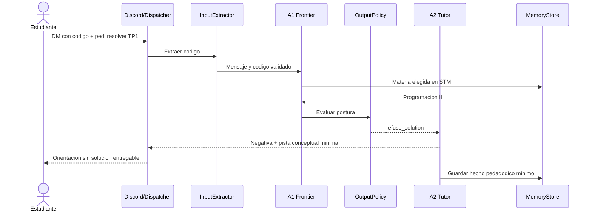
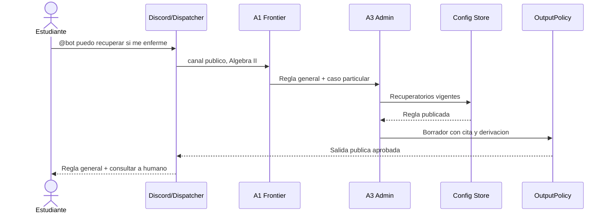
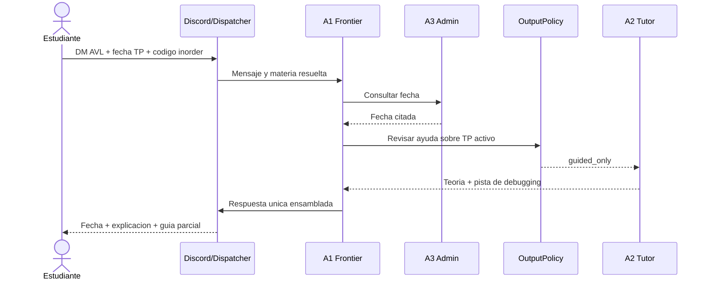
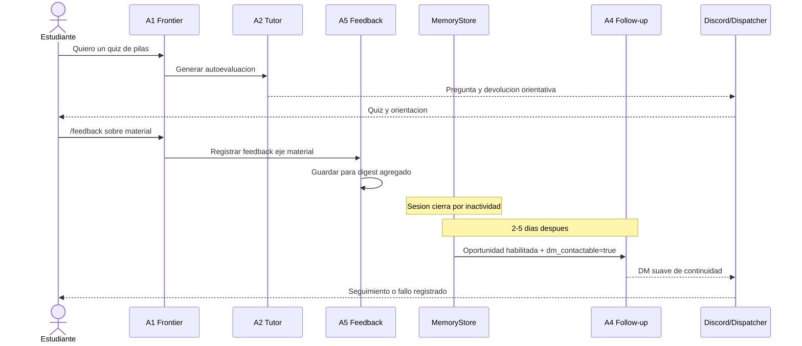

# Entregable 6 — Escenarios y trazabilidad

## 1. Escenario A — Código de evaluativa activa

**Contexto:** DM de Programación II; el estudiante ya seleccionó esa materia en la sesión. TP1 está activo.

1. El estudiante envía un bloque de código y pide: “pasame resuelto el ejercicio 3 del TP1”.
2. `InputExtractor` valida el bloque; `MemoryStore` aporta solo la materia elegida en STM.
3. A1 reconoce apoyo práctico y solicita la postura de salida.
4. `OutputPolicy` lee Config Store, identifica el TP activo y deriva a A2 con `refuse_solution`.
5. A2 rechaza producir una solución lista para entregar, pero señala una categoría de error o una pista mínima.
6. Dispatcher responde por DM y `MemoryStore` registra `tema=TP1`, `estado=stuck`, sin código crudo.

## 2. Escenario B — Regla general y caso particular

**Contexto:** canal público de Álgebra II; el estudiante menciona al bot: “me enfermé el día del parcial, ¿puedo recuperarlo?”.

1. SubjectRouter fija Álgebra II por el servidor.
2. A1 detecta información administrativa con caso personal.
3. A3 lee la regla vigente de recuperatorios en Config Store.
4. A3 redacta únicamente la regla general citada y deriva la evaluación del certificado o habilitación a docente/bedelía.
5. `OutputPolicy` confirma que la salida pública no contenga dato privado; Dispatcher publica.

## 3. Escenario C — Consulta mixta con ayuda parcial

**Contexto:** DM de Programación II. El TP de árboles está activo. El estudiante pregunta qué es AVL, cuándo entrega y por qué su recorrido `inorder` falla, adjuntando código.

1. A1 separa intención pedagógica y administrativa.
2. A3 obtiene la fecha publicada desde Config Store.
3. `OutputPolicy` marca la revisión del código como `guided_only`, porque es consulta parcial sobre un TP activo.
4. A2 explica AVL con cita de KB, propone diagnóstico conceptual del código y no reescribe la solución.
5. A1 ensambla explicación, fecha y orientación en una sola respuesta; Dispatcher la envía por DM.

## 4. Escenario D — Feedback y seguimiento

1. En DM, el estudiante pide un quiz de pilas; A2 lo genera (seguimiento ya habilitado por default y DM contactable porque el estudiante inició el privado).
2. El estudiante usa `/feedback` sobre claridad del material; A5 lo clasifica en eje `material` y lo agrega al digest.
3. La sesión cierra por inactividad; al tercer día, Scheduler invoca A4 por una duda abierta y verifica `dm_contactable=true`.
4. A4 redacta un DM suave con recordatorio de `/seguimiento desactivar`; Dispatcher envía o, si Discord rechaza el privado, registra `delivery_failed` y marca `dm_contactable=false`.

## 5. Escenario E — Transferencia consentida

**Contexto:** el estudiante resolvió una duda en DM y quiere compartir solo la pregunta (sin código) en `#consultas` de Programación II.

1. En DM, el estudiante escribe: “¿Podés publicar en #consultas que mi duda era sobre el caso base del factorial recursivo?”
2. A1 reconoce transferencia consentida y valida el fragmento solicitado.
3. `OutputPolicy` autoriza publicar únicamente ese texto genérico; no incluye código ni historial DM.
4. Dispatcher publica en `#consultas` citando que fue compartido a pedido del estudiante.

## 6. Escenario F — Aporte docente con dos pipelines

**Contexto:** canal `#material-catedra` de Programación II.

1. La docente envía `/incorporar-material` + PDF “Unidad 4 - Árboles” → A6 indexa en KB Store.
2. Luego envía `/incorporar-material El parcial pasa al 20/06` → A6 lo guarda en KB como aviso y **sugiere** `/actualizar-catedra`.
3. La docente ejecuta `/actualizar-catedra tipo:fecha parcial_1=20/06` → A6 versiona en Config Store.
4. A3 y `OutputPolicy` consumen la fecha oficial desde Config; A2 cita el PDF desde KB.

## 7. Cobertura

| Funcionalidad          | Escenario   |
| ---------------------- | ----------- |
| Teoría                 | C           |
| Práctica y código      | A, C        |
| Autoevaluación         | D           |
| Administrativo         | B, C, F     |
| Acompañamiento         | C, D        |
| Feedback docente       | D           |
| Memoria y proactividad | D           |
| Privacidad / transferencia | E      |
| Actualización docente  | F           |

Los escenarios trazan las decisiones críticas: ayuda graduada, derivación humana, ingreso de código, feedback voluntario, seguimiento con opt-out, transferencia consentida y pipelines A6 content/config.
