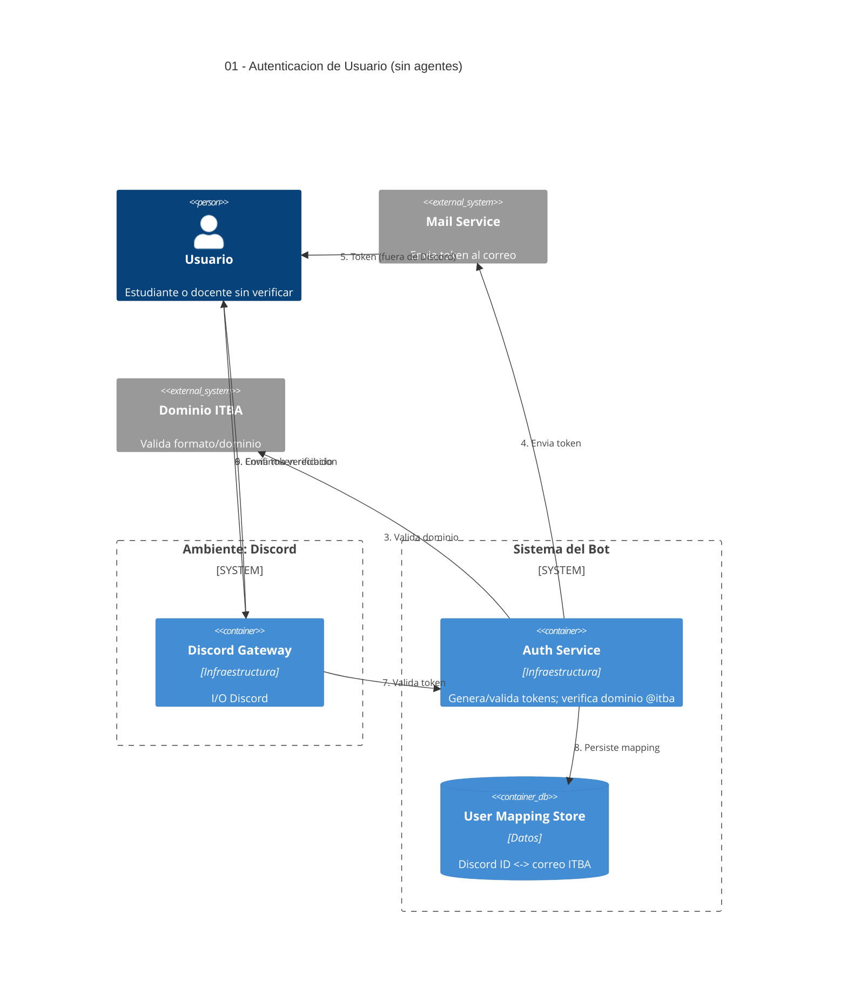

# 01 — Autenticación de Usuario (correo ITBA + token)

## Descripción

Mínima autenticación: el usuario informa su correo `@itba.edu.ar`, recibe un token por mail y lo ingresa en Discord. Se persiste el mapping `Discord ↔ cuenta ITBA`.

## Postura SMA

**Sin agentes.** Identidad y verificación por token son determinísticas: no hay deliberación, no hay objetivo pedagógico, no hay autonomía. Modelarlo como agente sumaría costo de coordinación sin aportar nada. Es **infraestructura de identidad** del sistema (ver [00-inventario-agentes.md](00-inventario-agentes.md)).

## Componentes (todos infraestructura)

- **Discord Gateway** — I/O con el ambiente.
- **Auth Service** — emite token, valida dominio @itba, valida token.
- **User Mapping Store** — persiste Discord ID ↔ correo ITBA.
- **Mail Service** (externo) — entrega del token al correo.

## Actores

- **Estudiante / Docente** — usuario de Discord aún no verificado.

## Referencias salientes

- Ninguna (es el punto de partida).

## Referencias entrantes

- **04, 05** — toda consulta del estudiante chequea el mapping antes de invocar agentes.

## Diagrama C4 Container

