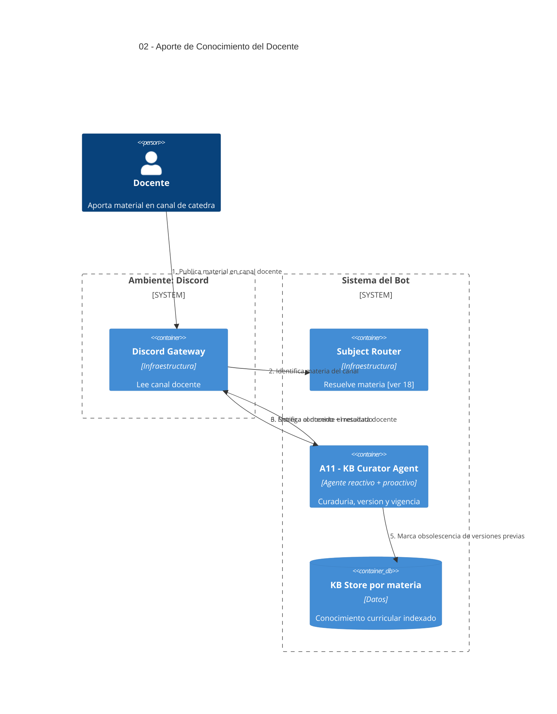

# 02 — Aporte de Conocimiento del Docente (KB)

## Descripción

Los docentes aportan contenido (mensajes, archivos, links, correcciones, avisos) en un **canal especializado de cátedra** (`#material-cátedra` o equivalente). Ese contenido se incorpora al conocimiento que consumen los agentes durante la cursada, con vigencia y versionado.

## Postura SMA

Usa un agente: **A11 — KB Curator Agent** (reactivo + algo proactivo).

- **Reactivo**: dispara la ingesta al detectar un nuevo aporte del docente.
- **Algo proactivo**: marca obsolescencia y prioriza versiones según vigencia, sin esperar pedido del docente.

La razón de ser un agente y no un script de ingesta plano: hay decisiones de **curaduría** (qué sustituye a qué, qué se etiqueta como vigente, cómo se prioriza ante conflicto entre fuentes), que requieren beliefs sobre el estado actual de la KB y desires sobre coherencia del conocimiento.

## Agente participante

- **A11 — KB Curator Agent**
  - Beliefs: estado actual de la KB por materia, vigencia/obsolescencia, autoría docente.
  - Desires: KB curada, versionada y coherente con lo último que dijo la cátedra.
  - Intentions: normalizar, chunkear, indexar, etiquetar vigencia, marcar obsoleto lo reemplazado.

## Infraestructura

- **Discord Gateway** (lee del canal docente).
- **Subject Router** (resuelve a qué materia pertenece el aporte → [ver 18](18-multi-materia.md)).
- **KB Store** por materia.

## Ambiente

- Canal docente especializado (`#material-cátedra` o equivalente), con escritura restringida a rol docente.

## Referencias entrantes

- **08, 09, 10, 11, 12** — todos los agentes que responden contenido leen la KB curada por A11.

## Referencias salientes

- **18** — particiona por materia.

## Diagrama C4 Container

