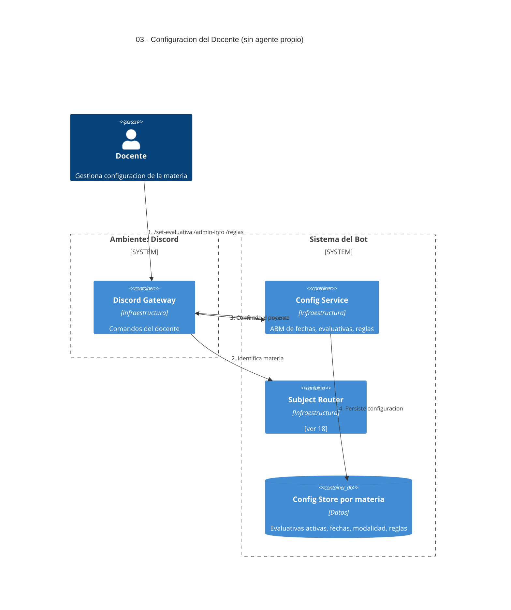

# 03 — Configuración del Docente (evaluativas, admin info, reglas)

## Descripción

El docente declara configuración administrativa de la materia: fechas, modalidad, reglas de evaluación y, sobre todo, **qué instancias evaluativas están activas** (insumo crítico de [10](10-bloqueo-evaluativas.md)).

## Postura SMA

**Sin agente propio.** Es un ABM de configuración: el docente publica, el sistema persiste. No hay deliberación; no hace falta autonomía. Se modela como **infraestructura administrativa**.

Quien **consume** la configuración sí son agentes (A5 Evaluative Guard y A6 Admin Info), pero la entrada del dato es operación directa del docente.

## Componentes (infraestructura)

- **Discord Gateway** — capta el comando `/set-evaluativa`, `/admin-info`, `/reglas` (o equivalente).
- **Config Service** — valida y persiste.
- **Subject Router** — particiona por materia ([ver 18](18-multi-materia.md)).
- **Config Store por materia** — fechas, modalidad, reglas, evaluativas activas.

## Actores

- **Docente** — único habilitado a escribir aquí.

## Referencias entrantes

- **10** — A5 lee evaluativas activas.
- **12** — A6 lee fechas/modalidad/reglas.

## Referencias salientes

- **18** — particiona por materia.

## Diagrama C4 Container

