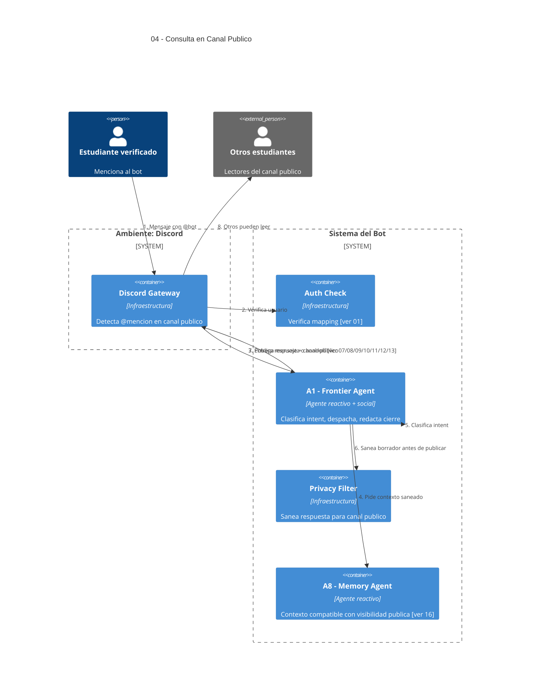

# 04 — Consulta de Estudiante en Canal Público (@mención)

## Descripción

En canales públicos el bot solo actúa cuando el estudiante lo **menciona**. La respuesta queda visible para todos los habilitados a leer el canal, por lo que el sistema debe **no exponer** memoria sensible ni detalles privados del alumno.

## Postura SMA

Punto de entrada y enrutamiento. Participa principalmente **A1 — Frontier Agent** (reactivo + social), que es el primer agente que actúa ante cualquier mensaje del estudiante: clasifica intent, aplica política de privacidad pública y delega al especialista correcto.

También participa **A8 — Memory Agent**, pero acá solo expone el contexto compatible con visibilidad pública (no filtra contenidos nacidos en DM).

Auth check y Privacy Filter son **infraestructura** (deterministas).

## Agentes participantes

- **A1 — Frontier Agent** (reactivo + social): clasifica intent, decide derivación, redacta cierre.
- **A8 — Memory Agent** (reactivo): provee contexto **saneado** apto para canal público.

## Infraestructura

- **Discord Gateway**, **Auth Check** (consulta User Mapping), **Privacy Filter** (sanitizer).

## Referencias salientes

- **01** — chequeo de autenticación.
- **07, 08, 09, 10, 11, 12, 13** — destinos posibles del dispatch.
- **16** — memoria saneada.

## Referencias entrantes

- **17** — el Follow-up Agent puede usar este canal según preferencias del usuario, pero por defecto prefiere DM.

## Diagrama C4 Container

