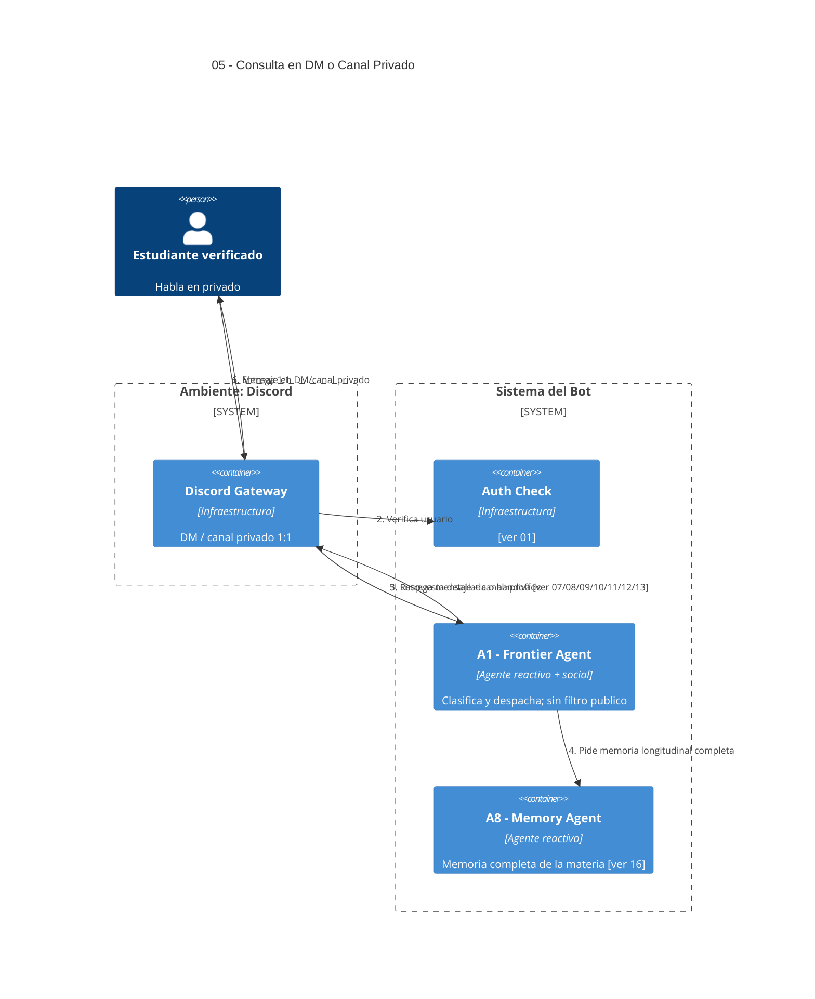

# 05 — Consulta de Estudiante en Canal Privado / DM

## Descripción

En DM o canal privado 1:1, el bot puede responder con **memoria completa** del alumno, sin sanear para visibilidad pública. Es el canal recomendado para código sensible o consultas largas.

## Postura SMA

Mismo punto de entrada que [04](04-consulta-canal-publico.md) pero con:

- **A1 — Frontier Agent** no aplica Privacy Filter público.
- **A8 — Memory Agent** entrega la memoria longitudinal completa (siempre acotada a la **misma materia** del canal).

## Agentes participantes

- **A1 — Frontier Agent** (reactivo + social).
- **A8 — Memory Agent** (reactivo) con visibilidad completa de la materia activa.

## Infraestructura

- **Discord Gateway**, **Auth Check**.

## Referencias salientes

- **01, 07, 08, 09, 10, 11, 12, 13, 16**.

## Referencias entrantes

- **06** — el sistema sugiere DM para código sensible.
- **17** — canal preferido por defecto para Follow-up.

## Diagrama C4 Container

