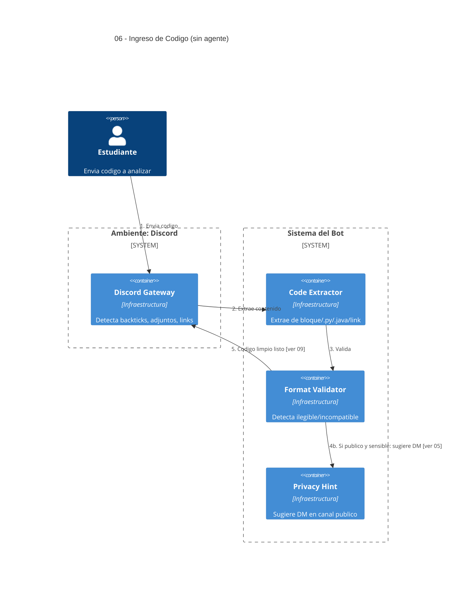

# 06 — Ingreso de Código (bloque, archivo o link)

## Descripción

Camino concreto por el que el código del alumno llega al sistema desde Discord (requisito obligatorio del enunciado, sección "Apoyo en la parte práctica"):

- Bloque de código con triple backtick.
- Adjunto de archivo de texto (`.py`, `.java`, `.txt`, etc.).
- Enlace a un mensaje previo en un hilo.

El sistema avisa cuando el formato es ilegible o incompatible y **sugiere** mover el intercambio a DM o hilo privado si el código se publicó en un canal público y parece sensible.

## Postura SMA

**Sin agente.** Extraer texto de un bloque, leer un adjunto o resolver un link son operaciones **deterministas**. Modelarlas como agente solo sumaría coordinación.

Eso sí, **A3 — Practice Agent** es quien **consume** el código limpio para analizarlo (ver [09](09-apoyo-practico.md)).

## Componentes (infraestructura)

- **Discord Gateway** — detecta backticks / adjuntos / links.
- **Code Extractor** — extrae el contenido según formato.
- **Format Validator** — detecta formato ilegible/incompatible.
- **Privacy Hint** — si el alumno publicó en canal público y el código parece sensible, sugiere mover a DM ([ver 05](05-consulta-canal-privado.md)).

## Referencias salientes

- **05** — sugerencia de mover a DM.
- **09** — entrega del código limpio al Practice Agent.

## Referencias entrantes

- **09** — Practice Agent recibe el código ya extraído y validado.

## Diagrama C4 Container

