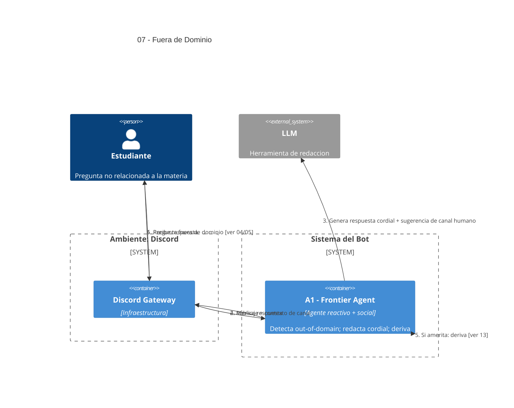

# 07 — Consultas Fuera de Dominio y Reconducción a Docentes

## Descripción

Cuando la consulta queda evidentemente fuera del dominio de la materia (curiosidades sin vínculo pedagógico, debates ajenos, etc.), el sistema responde **educadamente** aclarando que está fuera del alcance del agente de esa materia y **orienta al estudiante a consultar a los docentes** o al canal humano que la cátedra designe.

Política **fijada por el enunciado** (sección "Consultas fuera de dominio…").

## Postura SMA

Quien actúa es el **A1 — Frontier Agent**: detecta out-of-domain como parte de su clasificación de intent, redacta la respuesta cordial y, si corresponde, deriva al canal humano ([ver 13](13-derivacion-humanos.md)).

No agregamos un agente "Out-of-Domain" separado porque el Frontier ya tiene el contexto del mensaje y el intent: separarlo sería duplicar deliberación.

## Agentes participantes

- **A1 — Frontier Agent** (reactivo + social): clasifica out-of-domain y reconduce.

## Herramientas

- **LLM** (invocado por A1 para redactar la respuesta cordial).

## Referencias salientes

- **04, 05** — punto de origen de la consulta.
- **13** — derivación a canal humano si aplica.

## Referencias entrantes

- **04, 05** — la clasificación de A1 deriva acá.

## Diagrama C4 Container

