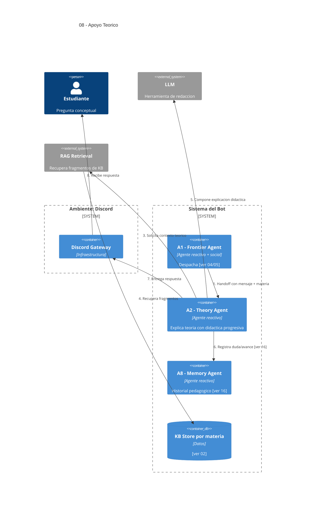

# 08 — Apoyo al Aprendizaje Teórico

## Descripción

Responder preguntas sobre la teoría de la materia, explicar conceptos con distinto nivel de profundidad, dar ejemplos simples y resumir temas. Usa la KB curada por el docente y se apoya en el historial pedagógico del alumno para hilar dudas previas.

## Postura SMA

Agente especializado: **A2 — Theory Agent** (reactivo). Tiene beliefs propios sobre la KB de la materia y el perfil del alumno; sus intentions son recuperar contexto vía RAG y componer una explicación didáctica.

**A8 — Memory Agent** provee y persiste el seguimiento pedagógico. RAG y LLM son herramientas que A2 invoca.

## Agentes participantes

- **A2 — Theory Agent** (reactivo): genera la explicación.
- **A8 — Memory Agent** (reactivo): aporta contexto previo del alumno y registra el avance.

## Herramientas

- **RAG retrieval** sobre KB Store de la materia.
- **LLM** para redacción.

## Infraestructura

- **KB Store** por materia ([ver 02](02-aporte-conocimiento-docente.md)).

## Referencias salientes

- **02** — KB curada.
- **04, 05** — el dispatch viene del Frontier Agent.
- **16** — Memory Agent.

## Referencias entrantes

- **04, 05** — A1 deriva acá cuando el intent es teórico.

## Diagrama C4 Container

