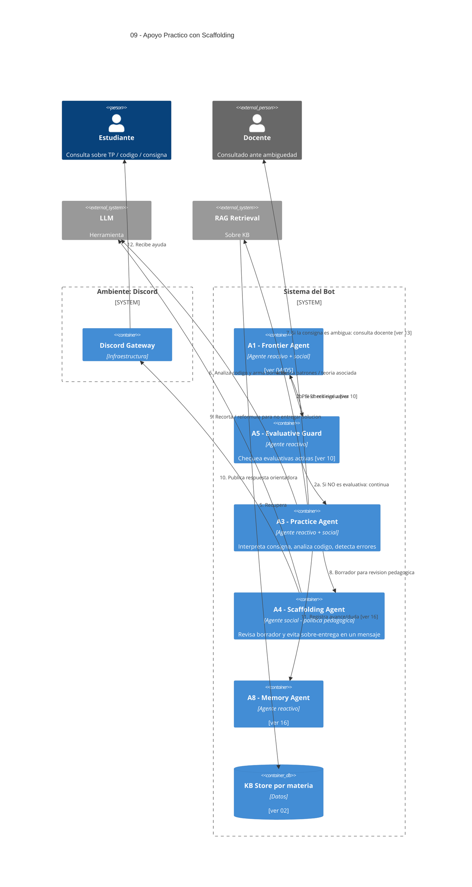

# 09 — Apoyo al Trabajo Práctico (incluye análisis de código)

## Descripción

Interpretar consignas sin oficializarlas, explicar procedimientos, revisar avances, detectar errores conceptuales o metodológicos, señalar inconsistencias, ayudar a destrabar y sugerir mejoras. En materias de programación incluye analizar el código del estudiante.

**Restricción del enunciado**: la respuesta del bot **no** debe equivaler a la solución entregable en un solo mensaje. El enunciado **no exige** detectar cadenas incrementales: la postura se regula respuesta a respuesta.

## Postura SMA

Este es el feature donde el SMA muestra más valor. Concurren varios agentes con responsabilidades distintas:

- **A3 — Practice Agent** (reactivo + social): genera el borrador de ayuda.
- **A4 — Scaffolding Agent** (social, política pedagógica): **antes de publicar**, revisa el borrador y lo recorta si entrega demasiado en un solo mensaje. Es el patrón de "agente de andamiaje" sugerido por el enunciado.
- **A5 — Evaluative Guard Agent** (reactivo): si la consulta cae sobre una evaluativa activa, redirige a [10](10-bloqueo-evaluativas.md) **antes** de invocar Practice.

El código llega a A3 vía el pipeline determinista de [06](06-ingreso-codigo.md).

## Agentes participantes

- **A3 — Practice Agent**
- **A4 — Scaffolding Agent**
- **A5 — Evaluative Guard Agent**
- **A8 — Memory Agent** (registra avance/duda)

## Herramientas

- **RAG retrieval** sobre KB.
- **LLM** para análisis y redacción.

## Referencias salientes

- **02, 06, 10, 13, 16**.

## Referencias entrantes

- **04, 05** — dispatch desde el Frontier Agent.

## Diagrama C4 Container

