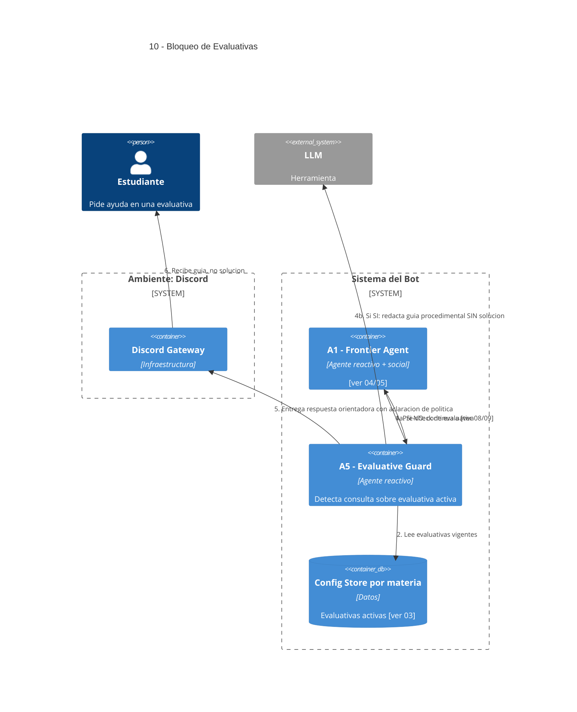

# 10 — Bloqueo de Instancias Evaluativas

## Descripción

El sistema no resuelve instancias evaluativas. Cuando la consulta del alumno cae sobre una evaluativa **declarada activa por el docente** (ver [03](03-configuracion-docente.md)), responde con guía procedimental sin dar la solución.

## Postura SMA

Agente dedicado: **A5 — Evaluative Guard Agent** (reactivo).

Razón de ser agente y no un check determinista: la **detección** de si una consulta cae sobre una evaluativa no es trivial (consigna puede estar parafraseada, fragmentos del enunciado pueden aparecer como código, etc.). Necesita beliefs sobre evaluativas activas y deliberación sobre el match. Su carácter es claramente **reactivo**: actúa cuando otro agente le pregunta.

## Agentes participantes

- **A5 — Evaluative Guard Agent** (reactivo).

## Infraestructura / Herramientas

- **Config Store** por materia ([ver 03](03-configuracion-docente.md)) — fuente de evaluativas activas.
- **LLM** — para evaluar similitud semántica entre consulta y evaluativa.

## Referencias salientes

- **03, 08, 09**.

## Referencias entrantes

- **04, 05, 09** — invocado como guard previo al especialista.

## Diagrama C4 Container

