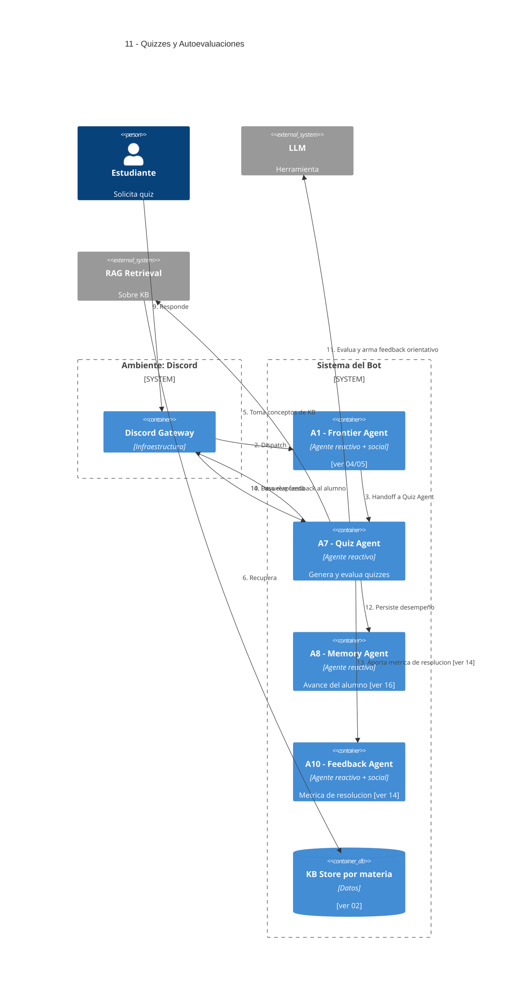

# 11 — Autoevaluaciones / Quizzes

## Descripción

Quizzes cortos, preguntas para verificar comprensión y feedback orientativo (no calificaciones oficiales).

## Postura SMA

Agente dedicado: **A7 — Quiz Agent** (reactivo).

Es agente porque tiene beliefs sobre el **desempeño previo** del alumno y desires de adaptar la dificultad. Sus intentions: generar el quiz, evaluar respuestas y registrar el desempeño.

Convive con **A8 — Memory Agent** (persiste avance) y aporta a **A10 — Feedback Agent** la métrica de "se resolvió / no se resolvió".

## Agentes participantes

- **A7 — Quiz Agent** (reactivo)
- **A8 — Memory Agent** (reactivo)
- **A10 — Feedback Agent** (reactivo + social) — consume métrica de resolución

## Herramientas

- **RAG retrieval** y **LLM** sobre la KB.

## Referencias salientes

- **02, 14, 16**.

## Referencias entrantes

- **04, 05** — dispatch desde A1.

## Diagrama C4 Container

