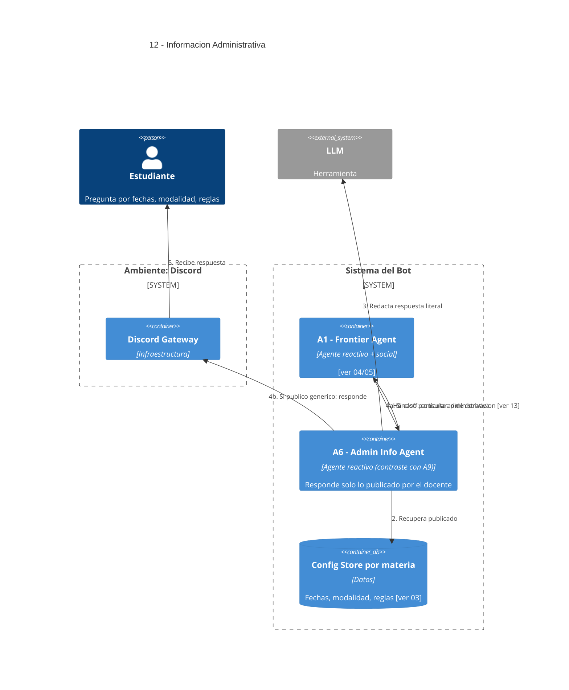

# 12 — Información Administrativa de la Cursada

## Descripción

Responde consultas administrativas públicas sobre la materia: fechas, modalidad, reglas de evaluación tal como están publicadas, organización general. Ante un **caso particular** (enfermedad, ausencia, trámite) no decide: usa información genérica de la materia y deriva al canal humano correspondiente ([ver 13](13-derivacion-humanos.md)).

## Postura SMA

Agente dedicado: **A6 — Admin Info Agent** (reactivo).

Es el contraste explícito que pide el enunciado frente a A9 (proactivo): **A6 nunca toma iniciativa**, solo responde lo publicado y se calla cuando no le consta. Sus beliefs son lo que el docente cargó en Config Store; no extrapola.

## Agentes participantes

- **A6 — Admin Info Agent** (reactivo, contraste con A9 proactivo).

## Herramientas

- **LLM** para redacción literal de lo publicado.

## Infraestructura

- **Config Store** por materia ([ver 03](03-configuracion-docente.md)).

## Referencias salientes

- **03, 04, 05, 13**.

## Referencias entrantes

- **04, 05** — dispatch desde A1.

## Diagrama C4 Container

