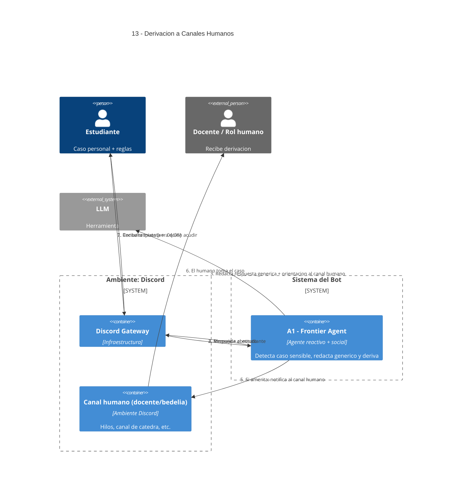

# 13 — Derivación a Humanos (consultas mixtas o sensibles)

## Descripción

Cuando la consulta mezcla **situación personal y reglas**, el sistema no decide: usa información genérica y orienta al estudiante hacia el área/rol/canal que corresponde (docente, bedelía, secretaría académica, etc.). No tramita ni valida certificados.

## Postura SMA

Quien actúa es **A1 — Frontier Agent**. Es coherente con su rol: detectar casos límite y derivar es parte de su responsabilidad social.

No agregamos un agente "Sensitive Case Classifier" separado porque sería duplicar deliberación con A1, que ya tiene el contexto y la habilidad de redactar respuestas cordiales con derivación.

Si el caso amerita aviso explícito al docente, A1 escribe en el canal docente o lo etiqueta para que lo lea.

## Agentes participantes

- **A1 — Frontier Agent** (social).

## Herramientas

- **LLM** para redactar respuesta genérica + sugerencia.

## Referencias salientes

- **04, 05, 07, 09, 12**.

## Referencias entrantes

- **07** — out-of-domain.
- **09** — Practice Agent ante ambigüedad de consigna.
- **12** — Admin Info ante caso particular.

## Diagrama C4 Container

