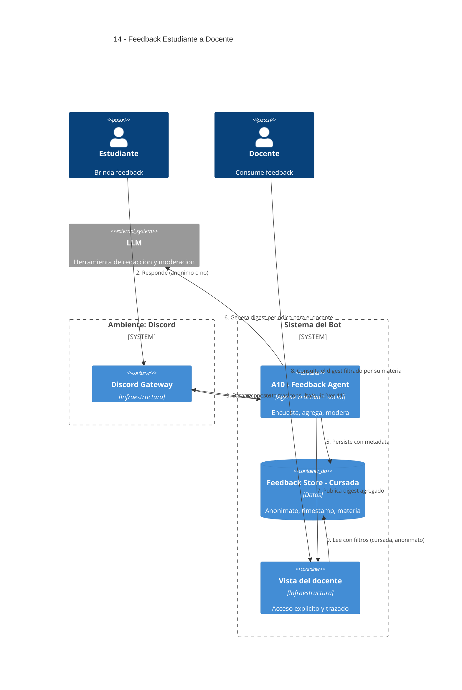

# 14 — Feedback Estudiante → Docente

## Descripción

Los estudiantes aportan retroalimentación sobre la cursada (claridad, ritmo, materiales, percepción de utilidad del asistente). Los docentes acceden de forma explícita a ese feedback, con metadata clara (anonimato, fecha, materia). Convive con la métrica de "se resolvió / no se resolvió" agregada por [11](11-quizzes-autoevaluacion.md).

**No** sustituye evaluaciones oficiales ni encuestas institucionales obligatorias.

## Postura SMA

Agente dedicado: **A10 — Feedback Agent** (reactivo + social).

Es agente porque toma decisiones no triviales:

- Cuándo encuestar (tras qué tipo de consulta, con qué frecuencia para no saturar).
- Cómo **agregar** el digest para el docente (qué incluir, qué omitir).
- Cómo **moderar** contenido ofensivo o malicioso antes de exponerlo.

La parte social es doble: con el alumno (encuesta) y con el docente (digest).

## Agentes participantes

- **A10 — Feedback Agent** (reactivo + social).

## Infraestructura

- **Feedback Store - Cursada** con metadata (anonimato, timestamp, materia).
- Vista del docente (filtros, agregación).

## Referencias salientes

- **04, 05, 11, 13** (moderación → humano si hace falta), **16**.

## Referencias entrantes

- **11** — recibe métrica de resolución de quizzes.

## Diagrama C4 Container

