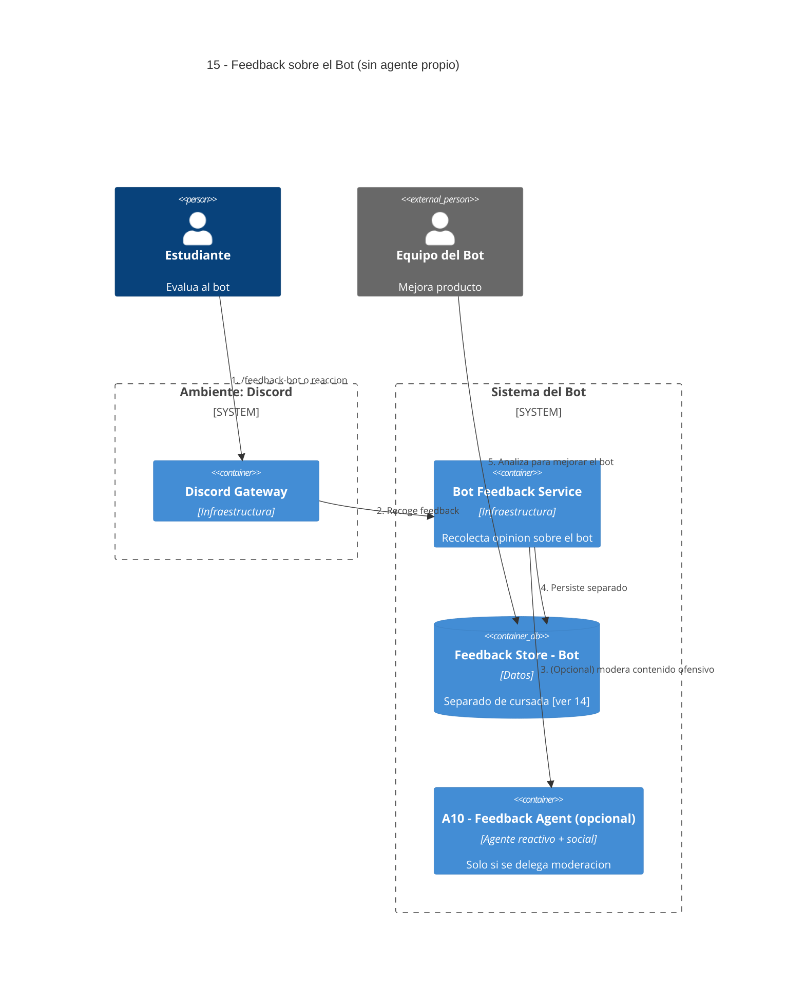

# 15 — Feedback Sobre el Bot (separado)

## Descripción

Feedback sobre el bot mismo (calidad de respuestas, utilidad, problemas técnicos), separado del feedback de cursada para no confundirlo con evaluación de la materia ni de los docentes.

## Postura SMA

**Sin agente propio.** Es recolección sencilla en un store separado y, opcionalmente, podría reutilizar las capacidades de moderación de **A10 — Feedback Agent**. No requiere deliberación autónoma específica; modelarlo como agente nuevo sumaría duplicación.

Se documenta como **infraestructura** que **opcionalmente** delega moderación al A10 existente.

## Componentes

- **Discord Gateway** — recoge `/feedback-bot` o reacciones de calificación.
- **Bot Feedback Service** — endpoint mínimo de recolección.
- **Feedback Store - Bot** — store separado del de cursada.

## Reutilización (opcional)

- **A10 — Feedback Agent** — puede ejecutar moderación si el contenido del feedback es ofensivo.

## Referencias salientes

- **14** — convive con (pero separado de) feedback de cursada.

## Referencias entrantes

- Ninguna estructural.

## Diagrama C4 Container

