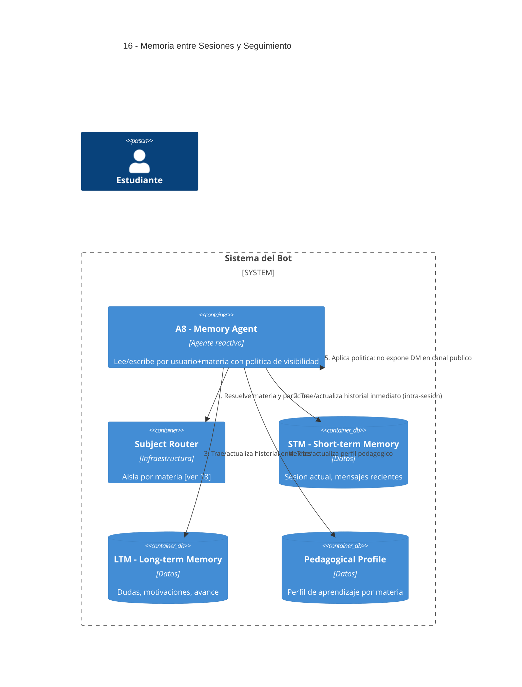

# 16 — Memoria entre Sesiones y Seguimiento Pedagógico

## Descripción

El sistema recuerda actividades del estudiante (temas, dudas, hilos pedagógicos) **entre sesiones**, por **usuario y por materia**, sin mezclar cursadas. Se distinguen tres capas:

- **STM (Short-term Memory)**: contexto intra-sesión, mensajes recientes. Estado compartido entre agentes durante un mismo intercambio.
- **LTM (Long-term Memory)**: persistencia entre sesiones (entre días). Dudas, motivaciones, unidades cursadas, hilos.
- **Pedagogical Profile**: perfil de aprendizaje por materia (estilo, fortalezas, debilidades).

Esta separación responde al **glosario obligatorio** del enunciado: *sesión* vs *conversación*, *memoria intra-sesión* vs *persistencia entre días*.

## Postura SMA

Agente dedicado: **A8 — Memory Agent** (reactivo).

Es agente porque toma decisiones no triviales sobre:

- Qué se conserva y qué se descarta (minimización).
- Qué se entrega según el **canal de origen** (no expone contenido nacido en DM a un canal público; ver privacidad por canal).
- Cómo se aísla por materia para no mezclar cursadas.

Lo invocan todos los agentes que necesitan contexto longitudinal.

## Agentes participantes

- **A8 — Memory Agent** (reactivo).

## Infraestructura

- **Memory Store** por usuario+materia (STM, LTM, Perfil).
- **Subject Router** ([ver 18](18-multi-materia.md)).

## Referencias salientes

- **18** — particionamiento por materia.

## Referencias entrantes

- **04, 05, 08, 09, 11, 14, 17** — todos consultan/actualizan memoria.

## Diagrama C4 Container

