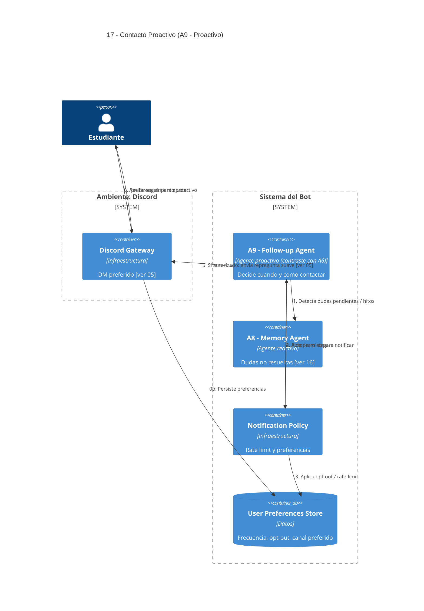

# 17 — Contacto Proactivo y Políticas Anti-Spam

## Descripción

El sistema vuelve a contactar al estudiante en Discord para verificar si todavía tiene dudas sobre temas previos y ofrecer continuidad razonable (recordatorio suave, repregunta pedagógica). El usuario controla la **frecuencia**, el **canal** y puede hacer **opt-out** completo.

Requisito directo de la funcionalidad 7 del enunciado.

## Postura SMA

Agente dedicado: **A9 — Follow-up Agent** (**proactivo**).

Es el contraste explícito que pide el enunciado frente a A6 (reactivo). Su carácter **proactivo** está en que **inicia** la interacción: tiene desires propios (acompañar pedagógicamente) e intentions que dispara sin necesidad de que el alumno hable primero.

Sus beliefs combinan dudas no resueltas (leídas de A8) con preferencias del usuario (store de preferencias).

## Agentes participantes

- **A9 — Follow-up Agent** (proactivo).
- **A8 — Memory Agent** (reactivo) — fuente de dudas pendientes.

## Infraestructura

- **Notification Policy** — aplica preferencias y rate-limit (anti-spam).
- **User Preferences Store** — frecuencia, opt-in/out, canal preferido.
- **Discord Gateway** — entrega final.

## Restricciones de diseño

- Respeta visibilidad por canal: si la duda nació en DM, el follow-up va por DM, no por canal público.
- Tope de frecuencia configurable; opt-out total siempre disponible.

## Referencias salientes

- **05** — canal preferido por defecto (DM).
- **16** — lee Memory Agent.

## Referencias entrantes

- Ninguna estructural; el scheduler dispara solo (proactivo).

## Diagrama C4 Container

