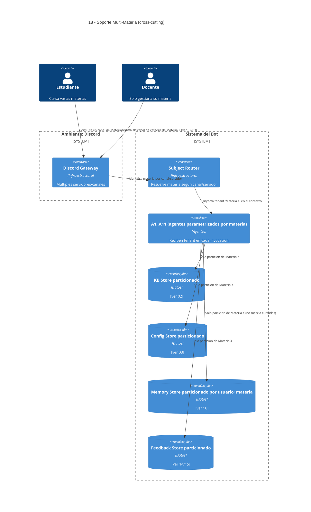

# 18 — Soporte Multi-Materia (cross-cutting)

## Descripción

El sistema opera para **N materias en paralelo**, cada una con su propio dominio de conocimiento, reglas, evaluativas y canal docente. **No** se mezclan contenidos entre cursadas: conocimiento, memoria y feedback siempre quedan acotados a la materia activa de la interacción.

Requisito obligatorio del enunciado (sección "Alcance multi-materia").

## Postura SMA

Decisión de diseño: **agentes genéricos parametrizados por contexto**, no un set de agentes por materia.

- Cada agente (A1..A11) opera siempre con un **tenant = materia activa** que recibe en cada invocación.
- Las **bases de datos** están particionadas por materia. Un agente nunca puede leer/escribir fuera de su tenant.
- El **Subject Router** (infraestructura) es quien resuelve la materia activa a partir del canal/servidor de Discord donde entró el mensaje, y la inyecta en el contexto.

Razón del diseño: agentes por-materia escalarían pobremente (con 30 materias, 30×11 agentes a coordinar). Genéricos parametrizados mantienen costo de coordinación constante y simplifican el aislamiento (un solo punto de control: el router).

## Componentes

- **Subject Router** — infraestructura determinista (lookup canal/servidor → materia).
- **A1..A11** — todos los agentes, parametrizados por materia.
- Stores particionados: **KB**, **Config**, **Memory**, **Feedback**.

## Manejo de ambigüedad

- Si el canal no determina materia (caso límite raro), A1 — Frontier Agent — pregunta explícitamente "¿de qué materia hablamos?" antes de despachar.
- Si dos materias comparten servidor y un alumno pregunta en un canal común, el Subject Router devuelve "ambiguo" y A1 fuerza la aclaración.

## Referencias salientes

- **02, 03, 14, 15, 16** — todos los stores particionados.

## Referencias entrantes

- Prácticamente todos los features invocan al Subject Router en algún paso.

## Diagrama C4 Container

