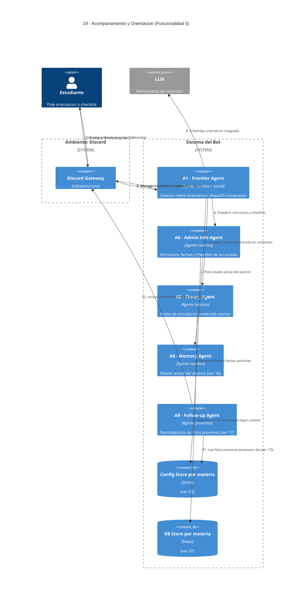

# 19 — Acompañamiento y Orientación (Funcionalidad 5)

## Descripción

Recordatorios generales, checklists de cursada y mensajes de orientación cuando el estudiante se siente perdido. Tiene dos modos:

- **Reactivo**: el estudiante pide orientación explícitamente ("no sé por dónde empezar", `/checklist`, "¿qué tengo que repasar antes del parcial?").
- **Proactivo (extensión de A9)**: el Follow-up Agent incluye recordatorios de hitos próximos de la cursada (fechas de entrega, parciales) en su ciclo de seguimiento, consultando el Config Store además de dudas pendientes.

## Postura SMA

No requiere un agente nuevo. Se cubre con coordinación de agentes ya existentes:

- **A1 — Frontier Agent**: detecta el intent de "orientación" o "estoy perdido" y realiza un dispatch compuesto: consulta a A6 y A2 en secuencia y ensambla la respuesta final.
- **A6 — Admin Info Agent**: aporta la estructura de la cursada, fechas próximas y checklist de hitos según lo publicado en Config Store.
- **A2 — Theory Agent**: sugiere un punto de entrada en el contenido teórico considerando lo que el alumno ya vio o tiene pendiente.
- **A8 — Memory Agent**: provee el estado actual del alumno para personalizar la orientación.
- **A9 — Follow-up Agent (extensión)**: además de hacer seguimiento sobre dudas, puede incluir recordatorios de hitos próximos usando el Config Store, sin necesidad de que el alumno pregunte.

La razón de no crear un agente dedicado: el "acompañamiento" no tiene beliefs ni desires propios que no cubran ya A1, A6, A2 y A9 en combinación. Agregar un agente nuevo solo para ensamblar su output sumaría coordinación sin deliberación nueva.

## Agentes participantes

- **A1 — Frontier Agent** (reactivo + social): detecta intent y orquesta.
- **A6 — Admin Info Agent** (reactivo): estructura y checklist.
- **A2 — Theory Agent** (reactivo): punto de entrada en contenido.
- **A8 — Memory Agent** (reactivo): estado actual del alumno ([ver 16](16-memoria-seguimiento.md)).
- **A9 — Follow-up Agent** (proactivo): extiende su ciclo con hitos próximos ([ver 17](17-contacto-proactivo.md)).

## Infraestructura

- **Config Store** por materia ([ver 03](03-configuracion-docente.md)) — fechas y checklist de la cursada.
- **KB Store** por materia ([ver 02](02-aporte-conocimiento-docente.md)) — contenido teórico para sugerencias de entrada.

## Referencias salientes

- **08** — apoyo teórico (si la orientación deriva en una consulta conceptual).
- **12** — info administrativa (si la orientación deriva en consulta puntual).
- **16** — memoria del alumno.
- **17** — ciclo proactivo de A9.

## Referencias entrantes

- **04, 05** — A1 despacha aquí cuando detecta intent de orientación.
- **17** — A9 extiende su ciclo proactivo con hitos de la cursada.

## Diagrama C4 Container

